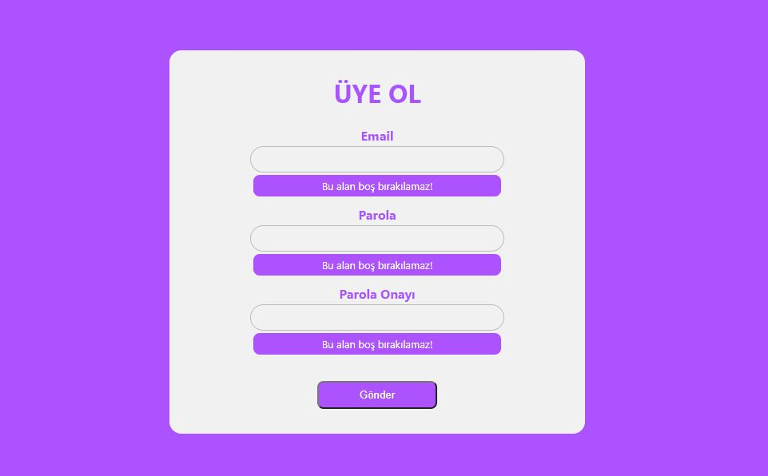

# Form Validasyonu

React kütüphanesi kullanarak oluşturduğum form çalışmasında [formik.org](https://formik.org/) ve [yup.js](https://github.com/jquense/yup) yapılarını
kullanarak validasyon işlemlerini kolaylıkla sağlayabildim.

Hata durumları;
- Parola belirtilen değerden kısa olduğunda,
- Parola ile onay parolası eşleşmediğinde,
- Email formatında değer girilmediğinde,
- Bütün inputlar boş bırakıldığında

veri gönderilmeyecektir.

Örneğin, bütün inputların boş bırakılması durumunda aşağıdaki gibi uyarı verecektir.

